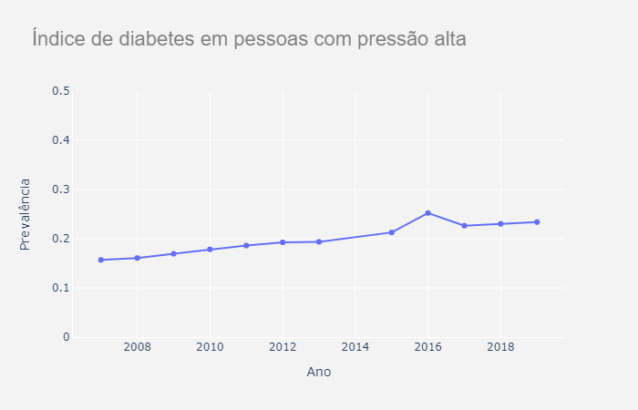

# Análise de Dados sobre Diabetes no Brasil - VIGITEL
## Data Analysis on Diabetes in Brazil - VIGITEL

# Descrição Resumida do Projeto
~~~
<Descreva resumidamente o que fará o projeto. O resumo idealmente deve: apresentar o contexto; indicar o problema; apresentar a sua solução para o problema; indicar porque a sua solução é melhor do que os esforços atuais (não obrigatório); concluir com os resultados alcançados.>
~~~
Neste projeto, foi avaliada a prevalência de diabetes no Brasil utilizando a base de dados Vigitel (Sistema de Vigilância de Fatores de Risco e Proteção para Doenças Crônicas por Inquérito Telefônico) de 2007 a 2019. Também foram avaliados fatores que poderiam ser associados a esta doença e realizadas análises estatísticas utilizando a linguagem de programação Python 3 e as bibliotecas Matplotlib, Pandas, Seaborn e Ploty, a fim de compreender melhor a diabetes ao longo do tempo, no Brasil. Pode-se inferir que a prevalência de diabetes: aumentou 6% em 13 anos; apresentou tendência de redução entre os que recebem o auxílio bolsa família do Governo Federal, diferentemente da tendência global; e é maior entre mulheres em relação aos homens. Além disso, o fator consumo de refrigerantes teve diminuição na prevalência.

# Abstract in English
~~~
<English version of the abstract.>
~~~

# Equipe
* Heitor Soares Mattosinho      - 262947
* Tainá Peres Passos            - 194220
* Stephania Slis Raggio Santos  - 137608
* João Guilherme Ito Cypriano   - 061701

# Vídeo do Projeto

[Vídeo](reports/videos/apresentacao_video.mp4)

# Introdução e Motivação

O diabetes é uma doença crônica que pode ser caracterizada por altos níveis de açúcar no sangue no caso do diabetes mellitus ou por falta ou não absorção de ADH (hormônio antidiurético) no caso do diabetes insipidus, que é uma doença mais rara. O diabetes afeta várias funções corporais, por isso é  uma doença metabólica (Figueiredo, 2009;Maraschin, 2010; WHO, 2020).

O diabete mellitus (DM) se divide em tipo um, dois, gestacional e relacionada a outros fatores. O DM tipo 1 ocorre porque as células beta do pâncreas produzem pouca ou nenhuma insulina por razões imunológicas ou por fatores idiopáticos (desconhecidos), acometendo normalmente crianças, mas também pode acometer outras faixas etárias e o tratamento consiste na administração de insulina. Há também o tipo 2, que acomete 90% do total de casos de diabetes, dentre eles há mais adultos acima de 30 anos, ele é relacionado a fatores genéticos e não há necessidade de uso de insulina, sendo recomendada a alteração de hábitos alimentares e perda de peso antes da doença ser instalada,  após a sua instalação é receitado o uso de hipoglicemiantes orais. Também há o DM gestacional e outros tipos de diabetes relacionados a doenças no pâncreas, infecções, síndromes genéticas, defeitos genéticos ou uso de drogas (Maraschin, 2010).

Cerca de 422 milhões de pessoas ao redor do mundo são acometidas por diabetes, sendo a maioria em países em desenvolvimento, e as mortes atribuídas a esta doença chegam a 1,6 milhões por ano.2 No Brasil, em 2016 as DCNT(doenças crônicas não transmissíveis) foram responsáveis por 74% das mortes, sendo 5% provenientes de diabetes (Brasil, 2020).
Todas essas informações motivam o estudo dos dados de amostras da população brasileira disponíveis no Vigitel (Sistema de Vigilância de Fatores de Risco e Proteção para Doenças Crônicas por Inquérito Telefônico) de 2007 a 2019 para verificar a prevalência desta doença e se há alguma relação com outros fatores também disponíveis nos dados do Vigitel (Brasil, 2020).

Portanto este projeto está dividido nas seguintes seções: 

~~~
├── Introdução e Motivação        <- apresentação do projeto
│   ├── O VIGITEL                   
│   ├── Perguntas da Pesquisa     <- O que pretendemos responder.
│   ├── Objetivos do projeto      <- Nossa proposta de abordagem.
│   └── Referências               <- Referência bibliográfica;
│
├── Recursos e Métodos               
│   ├── Base de Dados             <- Acesso às bases VIGITEL.
│   └── Ferramentas               <- Ferramentas e bibliotecas de programação utilizadas.
│
├── Metodologia                      
│   ├── Detalhamento do Projeto   <- Como o projeto foi estruturado.
│   └── Evolução do Projeto       <- Possíveis problemas enfrentados e possíveis mudanças de trajetória.
│
├── Resultados e Discussão        <- Conclusões finais do trabalho e as lições aprendidas.
│
├── Conclusões                    <- Este trabalho respondeu nossa pergunta?
│
└── Trabalhos Futuros             <- O que pretendemos evoluir para este projeto.
~~~

## O VIGITEL

O Vigitel foi implantado em 2006 em todas as capitais dos 26 estados brasileiros e no Distrito Federal, é um sistema de vigilância de fatores de risco e proteção para doenças crônicas por inquérito telefônico com pessoas maiores de 18 anos, nas 26 capitais brasileiras e no Distrito Federal, realizado pelo Ministério da Saúde.
O monitoramento dos fatores de risco, da frequência e distribuição das principais doenças crônicas fornece informações importantes para o planejamento de políticas públicas de promoção e prevenção que reduzam a ocorrência e a gravidade destas doenças, melhorando assim a saúde da população, além de descrever a evolução anual desses indicadores.
Entre as doenças incluem-se diabetes, obesidade, câncer, doenças respiratórias crônicas e cardiovasculares como hipertensão arterial, que têm grande impacto na qualidade de vida da população. 

Seu processo de amostragem é iniciado com o sorteio de números telefônicos fixos das capitais do país a partir dos cadastros de empresas telefônicas.
Primeiramente são sorteadas 5 mil linhas telefônicas por cidade, de forma sistemática e estratificada por CEP. A seguir, as linhas passam por um segundo sorteio e são divididas em réplicas de 200 linhas, sendo que cada réplica reproduz a mesma proporção de linhas por CEP do cadastro original.
A próxima etapa é identificar, entre as linhas sorteadas, aquelas que são elegíveis, excluindo empresas, linhas que não existem ou se encontram fora de serviço e linhas que não atendem a seis tentativas de chamadas feitas em dias e horários variados.
As consideradas elegíveis passam por uma segunda etapa da amostragem do inquérito, com sorteio de um dos adultos moradores no domicílio para responder o questionário.

## Perguntas de Pesquisa

Com base nos dados do Vigitel de 2007 a 2019 qual a prevalência de diabetes em amostras da população brasileira e quais fatores podem estar associados a esta doença?

## Objetivos do projeto

Avaliar a prevalência de diabetes em brasileiros e verificar se há associação com outros fatores da pesquisa Vigitel de 2007 a 2019.

# Recursos e Métodos

## Bases de Dados

Foi utilizado, exclusivamente, os dados disponíveis no portal do Departamento de Informação e Análise Epidemiológica da base de dados do [VIGITEL](http://svs.aids.gov.br/download/Vigitel/). Foram utilizados os dados anos de 2007 a 2019, para avaliar a evolução da prevalência de diabetes ao longo dos anos da pesquisa e suas associações. O uso das tabelas foi orientado pelo [Dicionário](http://svs.aids.gov.br/download/Vigitel/Dicionario-de-dados-Vigitel.xls) disponibilizado no [VIGITEL](http://svs.aids.gov.br/download/Vigitel/).  

Base de Dados | Endereço na Web | Resumo descritivo e uso
----- | ----- | -----
Base 01 | http://svs.aids.gov.br/download/Vigitel/Vigitel-2007-peso-rake.xls | `Pesquisa VIGITEL do ano de 2007`
Base 02 | http://svs.aids.gov.br/download/Vigitel/Vigitel-2008-peso-rake.xls | `Pesquisa VIGITEL do ano de 2008`
Base 03 | http://svs.aids.gov.br/download/Vigitel/Vigitel-2009-peso-rake.xls | `Pesquisa VIGITEL do ano de 2009`
Base 04 | http://svs.aids.gov.br/download/Vigitel/Vigitel-2010-peso-rake.xls | `Pesquisa VIGITEL do ano de 2010`
Base 05 | http://svs.aids.gov.br/download/Vigitel/Vigitel-2011-peso-rake.xls | `Pesquisa VIGITEL do ano de 2011`
Base 06 | http://svs.aids.gov.br/download/Vigitel/Vigitel-2012-peso-rake.xls | `Pesquisa VIGITEL do ano de 2012`
Base 07 | http://svs.aids.gov.br/download/Vigitel/Vigitel-2013-peso-rake.xls | `Pesquisa VIGITEL do ano de 2014`
Base 10 | http://svs.aids.gov.br/download/Vigitel/Vigitel-2014-peso-rake.xls | `Pesquisa VIGITEL do ano de 2014`
Base 11 | http://svs.aids.gov.br/download/Vigitel/Vigitel-2015-peso-rake.xls | `Pesquisa VIGITEL do ano de 2015`
Base 12 | http://svs.aids.gov.br/download/Vigitel/Vigitel-2016-peso-rake.xls | `Pesquisa VIGITEL do ano de 2016`
Base 13 | http://svs.aids.gov.br/download/Vigitel/Vigitel-2017-peso-rake.xls | `Pesquisa VIGITEL do ano de 2017`
Base 14 | http://svs.aids.gov.br/download/Vigitel/Vigitel-2018-peso-rake.xls | `Pesquisa VIGITEL do ano de 2018`
Base 15 | http://svs.aids.gov.br/download/Vigitel/Vigitel-2019-peso-rake.xls | `Pesquisa VIGITEL do ano de 2019`

## Ferramentas

Ferramenta | Endereço na Web | Resumo descritivo e uso
----- | ----- | -----
Python 3 | https://www.python.org/ | `<Descrição da Ferramenta 1 e para que ela foi usada no projeto.>`
Pandas | https://pandas.pydata.org/ | `<Descrição da Ferramenta 2 e para que ela foi usada no projeto.>`
Plotly | https://plotly.com/ | `<Descrição da Ferramenta 2 e para que ela foi usada no projeto.>`
Matplotlib | https://matplotlib.org/ | `<Descrição da Ferramenta 2 e para que ela foi usada no projeto.>`
Seaborn | https://seaborn.pydata.org/ | `<Descrição da Ferramenta 2 e para que ela foi usada no projeto.>`

# Metodologia
~~~
<Abordagem/metodologia adotada, incluindo especificação de quais técnicas foram exploradas, tais como: aprendizagem de máquina, análise de redes, análise estatística, ou integração de uma ou mais técnicas.>
~~~

## Detalhamento do Projeto
~~~
<Apresente aqui detalhes da análise. Nesta seção ou na seção de Resultados podem aparecer destaques de código como indicado a seguir. Note que foi usada uma técnica de highlight de código, que envolve colocar o nome da linguagem na abertura de um trecho com `~~~`, tal como `~~~python`.

Os destaques de código devem ser trechos pequenos de poucas linhas, que estejam diretamente ligados a alguma explicação. Não utilize trechos extensos de código. Se algum código funcionar online (tal como um Jupyter Notebook), aqui pode haver links. No caso do Jupyter, preferencialmente para o Binder abrindo diretamente o notebook em questão.>
~~~

~~~python
df = pd.read_excel("/content/drive/My Drive/Colab Notebooks/dataset.xlsx");
sns.set(color_codes=True);
sns.distplot(df.Hemoglobin);
plt.show();
~~~

## Evolução do Projeto

No começo do projeto o grupo tinha uma ideia muito geral sobre como abordaríamos o uso e a visualização dos dados e ao longo do processo conseguimos focar mais em visões mais específicas. Durante a escolha dos bancos de dados que seriam usados, o grupo decidiu tentar encontrar um banco único que abrangesse o máximo de variáveis relevantes para o projeto. Partimos por esse caminho para evitar o grande desafio que é fazer a integração de diferentes bases de dados que contêm diferentes variáveis e também diferentes cortes da população, e que em sua maioria resultando em dados heterogêneos e desbalanceados, gerando uma complexidade muito grande para um projeto de curto prazo. O banco que mais nos pareceu interesse foi o Vigitel, que é uma coleta anual do Ministério da Saúde de dados obtidos por ligações telefônicas nas capitais do Brasil, com um questionário volumoso e bem abrangente. 
	
Inicialmente, o Vigitel aparentava ser uma base excelente para o que procurávamos, já que a bases possuíam dados bem sólidos -- anualmente uma tabela contava com, em torno de 51.000 adultos que respondiam um questionário com uma média de 180 perguntas, o que gerava 9.000.000‬ de respostas. Essa base de dados começou em 2006, contudo descartamos a tabela do primeiro ano, visto que ela gerava dados que estavam fora do padrão dos outros anos, provavelmente por algum motivo de diferença de código das colunas ou ordem dos valores. Os dados originais, somando as tabelas de 2007 até 2019, contabilizaram 128.931.758 células de resposta, e após a limpeza e seleção das colunas conseguimos diminuir para 15.546.620 células. 
	O Vigitel conta com um dicionário contendo a descrição de cada nome-código de coluna e o tipo do dado armazenado. Como exemplo, veja a figura abaixo sobre como a diabetes aparece nesse dicionário:

Uma dificuldade grande que tivemos com a leitura das tabelas é que existem muitas colunas que não estão descritas nesse dicionário. Portanto, podemos ter potencialmente perdido colunas que seriam importantes para uma visualização melhor dos dados e, consequentemente, de gráficos mais significativos. Algumas das tabelas só existiram por um período, como as tabelas que forneciam informações sobre a pessoas que comem doce, ou também a tabela sobre quem recebia bolsa família, que só começou a existir a partir de 2015.

# Resultados e Discussão

<Apresente os resultados da forma mais rica possível, com gráficos e tabelas. Mesmo que o seu código rode online em um notebook, copie para esta parte a figura estática. A referência a código e links para execução online pode ser feita aqui ou na seção de detalhamento do projeto (o que for mais pertinente).

A discussão dos resultados também pode ser feita aqui na medida em que os resultados são apresentados ou em seção independente. Aspectos importantes a serem discutidos: É possível tirar conclusões dos resultados? Quais? Há indicações de direções para estudo? São necessários trabalhos mais profundos?>

A média da idade de início da diabetes aumentou 3 anos desde 2015. Isso pode ser um sinal de que a população está melhorando seus hábitos, visto que elas estão tendo diabetes em um período mais tardio. Após a visualização dos dados essa pesquisa pôde concluir que a população das capitais estão diminuindo o consumo de refrigerantes de forma significativa. Não foi encontrado nenhuma pesquisa que fizesse essa relação durante os anos com a população adulta brasileira.

Pode-se observar a partir dos gráficos com dados de nível de escolaridade, que a prevalência de diabetes e o nível de escolaridade são inversamente proporcionais, ou seja, quanto maior o nível de instrução menor é a prevalência de diabetes, na literatura já foi estudado este componente socioeconômico em uma unidade básica de saúde em Ribeirão Preto (SP) [1], em que portadores de diabetes mellitus tipo 2 apresentavam em média 4,54 anos de estudo.

Outro fato interessante de ser observado é o aumento da prevalência de diabetes mellitus ao longo dos anos, de 2007 a 2019, em todos níveis de instrução, porém há um aumento mais acentuado nos níveis de instrução mais baixos,  isso pode ser visto no grupo de indivíduos que nunca estudou em que o aumento foi de 8% e no grupo com ensino fundamental incompleto que foi de 9%, ao passo que no grupo que possuía ensino superior completo ou pós graduação esse aumento foi de apenas 4% para cada um. Além disso, analisando intragrupo, isto é, somente dentro de um grupo de nível de escolaridade, a prevalência de diabetes é maior entre os que nunca estudaram e  também no fundamental incompleto, comparado aos demais.

# Conclusões
 
- Prevalência de diabetes aumentou 6% em 13 anos;
- Prevalência de consumo de refrigerante diminuiu;
- Prevalência de diabetes em pessoas com bolsa família apresenta tendência de redução, diferentemente da tendência global;
- Prevalência maior entre as mulheres em relação aos homens, e mais que o dobro em 2019;

# Trabalhos Futuros

Este trabalho demonstrou o quão importante é entender a base de dados e saber quais gráficos e tabelas melhor representam o resultado de uma análise. No caso do VIGITEL, por ser em formato de pesquisa (_Survey_) encontramos a dificuldade de se utilizar o **peso rake**, conforme citado na página do VIGITEL. Portanto, como trabalhos futuros é aprofundar a programação para que leve em consideração esta ponderação nos dados, além de procurar outras bases de dados brasileiras referentes à incidência e prevalência de diabetes.

- Utilizar outras bases de dados;
- Dados socioeconômicos;
- Dados alimentícios mais complexos;
## Referência

> [1] RODRIGUES, Flávia Fernanda Luchetti et al . Relação entre conhecimento, atitude, escolaridade e tempo de doença em indivíduos com diabetes mellitus. Acta paul. enferm.,  São Paulo ,  v. 25, n. 2, p. 284-290,    2012 .   Available from <http://www.scielo.br/scielo.php?script=sci_arttext&pid=S0103-21002012000200020&lng=en&nrm=iso>. access on  03  July  2020.  http://dx.doi.org/10.1590/S0103-21002012000200020.

> [2] FIGUEIREDO, Danielly Mesquita; RABELO, Flávia Lúcia Abreu. Diabetes insipidus: principais aspectos e análise comparativa com diabetes mellitus. **Semina: Ciências Biológicas e da Saúde**, v. 30, n. 2, p. 155-162, 2009.

> [3] Diabetes overview. Disponível em <https://www.who.int/health-topics/diabetes#tab=tab_1>. Acesso em: 01 jul. 2020.

> [4] MARASCHIN, Jorge de Faria et al. Classificação do diabete melito. **Arq. Bras. Cardiol**.,  São Paulo ,  v. 95, n. 2, p. 40-46,  Aug.  2010 .   Available from <http://www.scielo.br/scielo.php?script=sci_arttext&pid=S0066-782X2010001200025&lng=en&nrm=iso>. access on  02  July  2020.  https://doi.org/10.1590/S0066-782X2010001200025.

> [5] BRASIL. Ministério da Saúde. Vigitel Brasil 2019: vigilância de fatores de risco e proteção para doenças crônicas por inquérito telefônico. Brasília, DF: Ministério da Saúde, 2020. p. 14.

